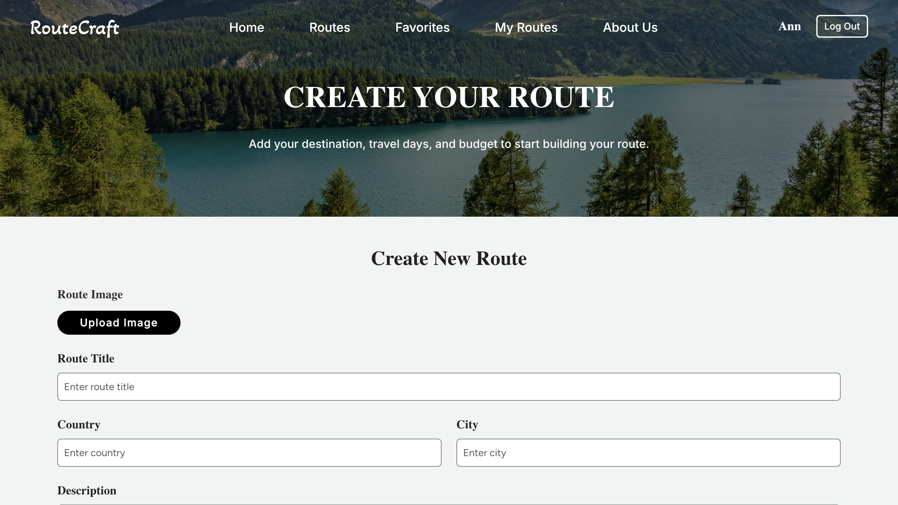

# RouteCraft 🌍✈️  
**Discover and Share Unique Travel Routes Around the World**

RouteCraft is a web platform where travelers from all over the globe can share, explore, and get inspired by tourism routes across different cities, countries, and cultures. Whether you're planning a weekend getaway or a month-long adventure, RouteCraft helps you find curated travel experiences tailored by real people.

---

## 🚀 Features

- 📍 **Create and Share Routes**: Share your personal travel itineraries including stops, descriptions, and recommendations.
- 🔎 **Search & Filter**: Easily browse routes by country, city, category (nature, culture, food, etc.), or duration.
- 💬 **Comment & Connect**: Engage with other travelers, ask questions, and exchange tips.
- 🧳 **Save Favorites**: Bookmark routes you love and want to try later.

---

## 🖼️ Screenshots


Here are some previews of the RouteCraft user interface:



*Form for creating a new travel route.*


*User dashboard with created routes.*


*Interactive map displaying selected route stops.*
---

## 🛠️ Technologies Used

- **Frontend**: React 
- **Backend**: Laravel, Inertia
- **Database**: MySQL
- **Map Integration**: Google Maps API
- **Authentication**: Session-based or OAuth
- **Hosting**: Microsoft Azure

---

## 🔧 Getting Started

### Prerequisites

- Node.js and npm
- PHP and Composer (for Laravel backend)
- MySQL
- Git

### Installation

1. **Clone the repository**  
   ```bash
   git clone https://github.com/yourusername/routecraft.git
   cd routecraft
   cd client
   npm install
   
   cp .env.example .env
   php artisan key:generate
2. **Install frontend dependencies**
   ```bash
   cd ../server
   composer install

3. **Install backend dependencies**
   ```bash
   cd ../server
   composer install
   cp .env.example .env
   php artisan key:generate

4. **Configure environment variables**
   ```bash
   Update .env with your database and Google Maps API credentials.

5. **Configure environment variables**
   ```bash
   php artisan migrate

6. **Start the backend server**
   ```bash
   php artisan serve

7. **Start the frontend development server**
   ```bash
   cd ../client
   npm start

## 📁 Project Structure
   ```bash
   routecraft/
   ├── client/          # Frontend React app
   ├── server/          # Laravel backend API
   ├── public/          # Static assets
   ├── .env.example     # Environment config template
   ├── README.md
   ```
## 👨‍💻 Developers

- [Dmytro Bokov](https://github.com/BokovDmitry)
- [Karina Yakovennko](https://github.com/yakovenkoka/yakovenkoka)
